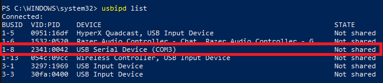
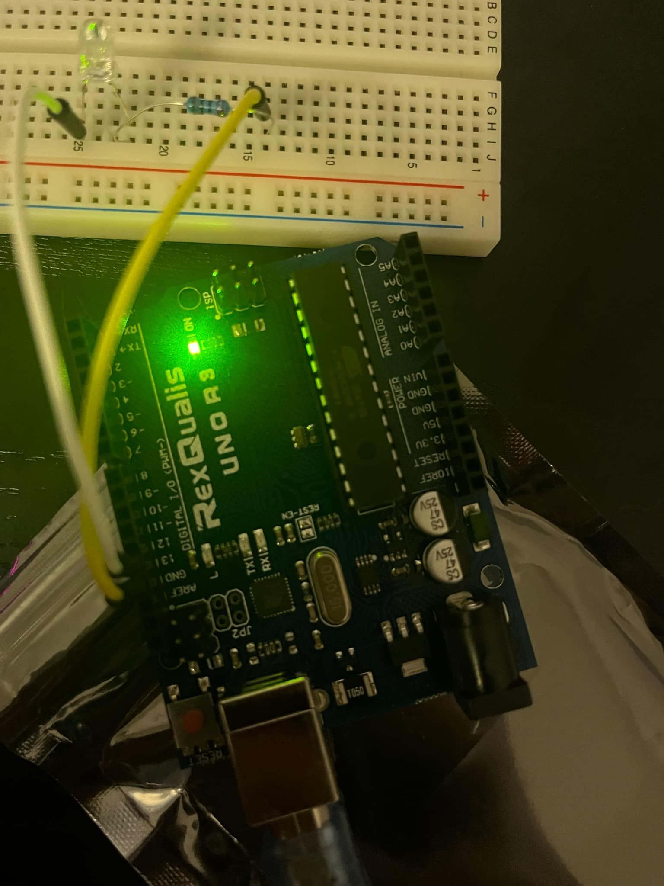
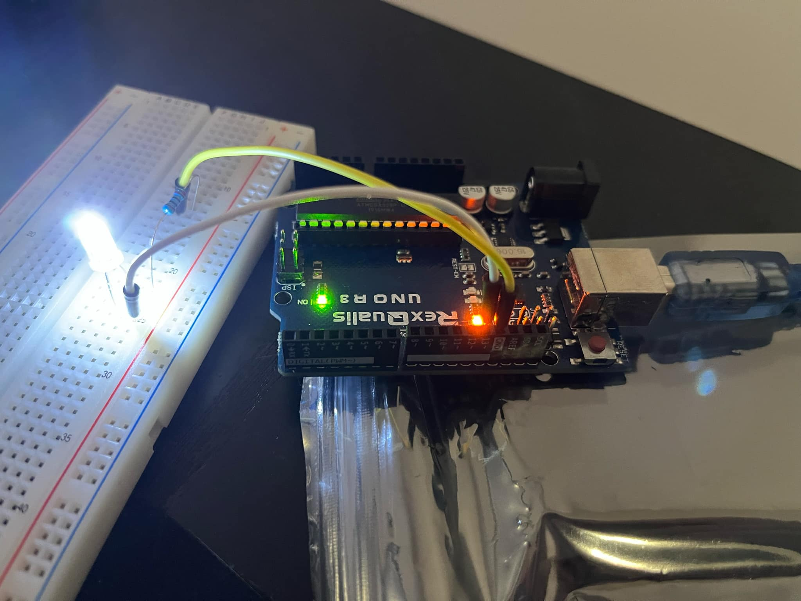

# Setup

Setting up a system for putting a rust program on Arduino is not as simple as I imagined it would be. I'm working on Windows and the support is pretty minimal here. The workaround I found was to use Windows Subsystem for Linux (WSL) and pass the USB through to WSL.

## My approach

I found [this tutorial](https://blog.logrocket.com/complete-guide-running-rust-arduino/) on blog.logrocket.com. This is what I followed along to, but just in case the link breaks, the steps are as follows:
1. In Windows, install [usbipd](https://github.com/dorssel/usbipd-win/releases)
1. WSL should be pre-installed on Windows 10/11 installations. You can check this by running `wsl list` in PowerShell. It may not print anything, but so long as you don't see an error it is installed.
1. On the Microsoft Store, install Ubuntu 22.04.X LTS published by Canonical Group Limited (at the time of writing this, Ubuntu 24.04.X is still very new and the troubleshooting guides are sparse, so I will be sticking to Ubuntu 22.04 for the time being).
1. Run the command `wsl --install -d Ubuntu-22.04` to install an Ubuntu WSL instance.
1. Once installed, follow the prompts to create a user. (If you do not see something like `{username}@{computer name}:~` in your terminal, run `wsl` to enter the WSL instance).
1. Once all of this is installed, visit [https://www.rust-lang.org/tools/install](https://www.rust-lang.org/tools/install) and install rustup by following the **WSL instructions**. You will need to run the command within the WSL terminal.
1. Once rust is installed, run `rustup toolchain install nightly` to install the experimental rust toolchain. Arduino is not supported in the stable toolchain.
1. Next up, we need to install a bunch of system-level dependencies on the ubuntu system. Run `sudo apt update && sudo apt upgrade` to update the system
1. Now run `sudo apt install avr-libc gcc-avr pkg-config avrdude libudev-dev build-essential` to install the dependencies.
1. Some more dependencies. Run `cargo +stable install ravedude`
1. One more dependency. `cargo install cargo-generate` NOTE: If you see an error about not being able to find the OpenSSL library, you can run this with `cargo install cargo-generate --features vendored-openssl` to install the vendored OpenSSL copy.
1. `cd` into the location where you want your project folder to be created
1. run `cargo generate --git https://github.com/Rahix/avr-hal-template.git` to create a copy of the templated Arduino rust project.
1. N.B., If there is an error when installing the libudev-sys crate, you will have to include it in your cargo.toml file under dependencies and install it using `sudo apt-get install libudev-dev`: 
```
[dependencies]
libudev-sys = "0.1"
```
15. navigate into the project folder and run `cargo build` to make sure you've got everything installed.
1. In windows, run `usbipd list` to list the USB devices connected. To find which one your Arduino is, you can run this command, then unplug the arduino and run it again.
1. In my case, it was this one:



18. We need to pass this USB through to WSL, so we are going to run the following (see [Microsoft tutorial](https://devblogs.microsoft.com/commandline/connecting-usb-devices-to-wsl/)):
1. `usbipd bind --busid 1-8`. Replace 1-8 with whatever BUSID you see in your `usbipd list` printout.
1. `usbipd attach --wsl --busid 1-8`. Replace 1-8 with whatever BUSID you see in your `usbipd list` printout.
1. The USB is now passed through to WSL.
1. In WSL, we need to install a couple more dependencies. Run the following:
1. `sudo apt install linux-tools-5.4.0-77-generic hwdata`
1. `sudo update-alternatives --install /usr/local/bin/usbip usbip /usr/lib/linux-tools/5.4.0-77-generic/usbip 20`
1. Almost there! We need to find the USB device in WSL now. Run `dmesg | grep tty`. You should see something like this (ttyXXXXXX is the part we're looking for):


26. `cd` back into your rust project folder
1. Run `export RAVEDUDE_PORT=/dev/tty{your device ID}`
1. And finally run `cargo run`. This will send the blinkey code to your arduino.
1. You should see an output like so:
```
... a bunch of junk ...

Reading | ################################################## | 100% 0.05s
  Programmed target/avr-atmega328p/debug/arduino.elf
     Console /dev/ttyACM0 at 57600 baud
             CTRL+C to exit.
```
30. The blinkey program is programmed to run on pin D13 (this is short for digital I/O 13).
1. Plug 2 wires into the ground and D13 pins, and wire them up through the LED (don't forget to add a resistor or you might burn out your LED!)



